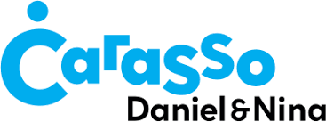
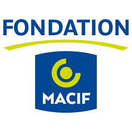

# Contact and partners

If you want to join the consortium, or take part in any form to this open and contributive project, please drop us a line at **hello@datafoodconsortium.org**.

You can also [join our Slack.](https://join.slack.com/t/datafoodconsortium/shared_invite/zt-83hxu18m-dUNX0qO1ryIWvkemWEpEgQ) 

Follow our blog on [http://datafoodconsortium.org/](http://datafoodconsortium.org/).

The consortium is currently facilitated by [Myriam Bouré](https://www.linkedin.com/in/myriamboure/?locale=en_US).

## Participants

Participants vary all the time, but we can mention some active member organizations, that are mainly located in France as the project started there :

* [Open Food France](https://www.openfoodfrance.org/) and [Open Food Network](https://openfoodnetwork.org/) more generaly, project coordinators
* [Virtual Assembly](https://www.virtual-assembly.org/association-virtual-assembly/), technical facilitators
* [The Food Assembly](https://laruchequiditoui.fr/fr) \(La Ruche Qui Dit Oui / Equanum\)
* [Panier Local](https://www.panierlocal.com/) \(CLEOP\)
* [Cagette](https://www.cagette.net/) \(ALILO\)
* [Elzeard](https://www.elzeard.co/)
* [Promus](https://www.promus.fr/)
* Le chemin des mûres
* and many others !

## Funders and supporters

The project started in France and project leaders have found financial support until now mainly through 3 French Foundations and Institutions :

We feel super grateful for their support, that enable you to move forward since January 2017 !

