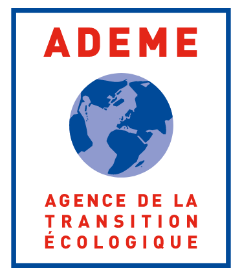

# Contact and partners

If you want to join the consortium, or take part in any form to this open and contributive project, please drop us a line at **hello@datafoodconsortium.org**.

You can also [join our Slack.](https://join.slack.com/t/datafoodconsortium/shared\_invite/zt-83hxu18m-dUNX0qO1ryIWvkemWEpEgQ)

Follow our blog on [http://datafoodconsortium.org/](http://datafoodconsortium.org/).

The consortium is currently facilitated by Caroline Brakel.

## Participants

Participants vary all the time, but we can mention some active member organizations, that are mainly located in France as the project started there:

* [Open Food France](https://www.openfoodfrance.org/) and [Open Food Network](https://openfoodnetwork.org/) more generally, project coordinators
* [Socleo](https://www.socleo.fr/) (ex-Panier Local, CLEOP)
* [Virtual Assembly](https://www.virtual-assembly.org/association-virtual-assembly/), technical facilitators
* [AlmaFood](https://almafood.fr)
* [Mycelium](https://www.virtual-assembly.org/demo-av-mycelium-des-apps-de-gestion-interoperables-libres-et-ethiques-au-service-des-paysans-19-avril-a-17h/)
* [Elzeard](https://www.elzeard.co/)
* and many others !

## Funders and supporters

The project started in France and project leaders have found financial support until now mainly through 3 French Foundations and Institutions:

<figure><figcaption></figcaption></figure>

We feel super grateful for their support, that enable you to move forward since January 2017!
