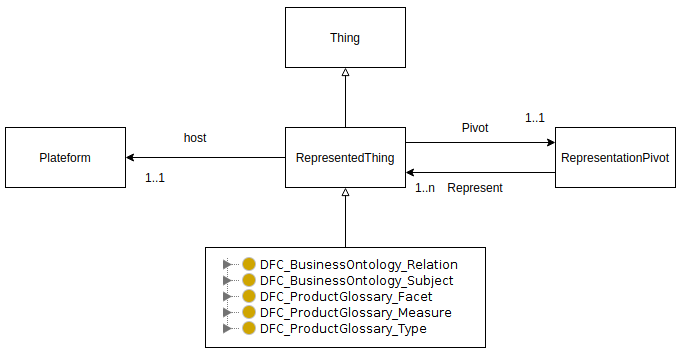

# Technical ontology

## Usage

This ontology allow to describe subject hosted in platform and equivalent subject hosted in an other Platform.

Links between two or more subjects can be done by a human thanks to prototype. It is the main use of the prototype and a key of interoperability.

DFC provides way to build links repository of subject hosted in platforms thanks to open source software using common Ontology and Protocol. This repository of subjects is needed to communication between platform because a platform have to know equivalent subject of his own to interact with an other platform using Protocol and Ontology.

## Concept

All Subject of Business and Product Glossary extend RepresentedThing. A Represented Thing is hosted in Platform and linked to other Represented Things thanks to Representation Pivot.

DFC prototype create a copy of imported Subject from platform and, during first import from one platform,  a DFC subject which fork platform subject and link platform subject and DFC subject. Subject imported from an other platform later have to be linked to those two previous subject by user thanks to User Interface or algorithms or both.

