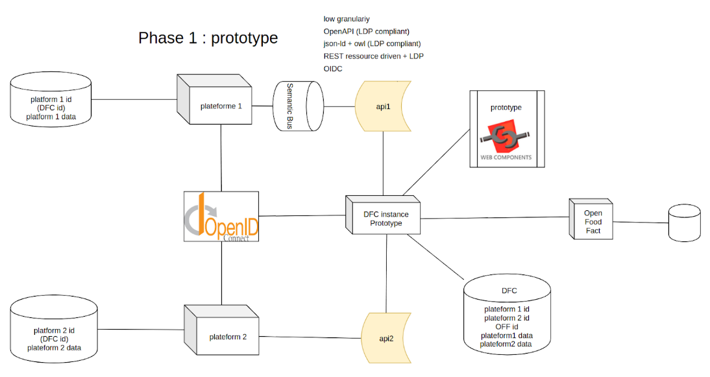
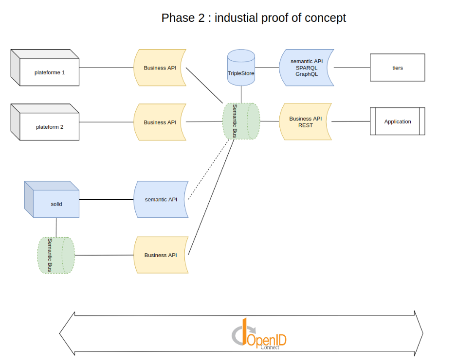
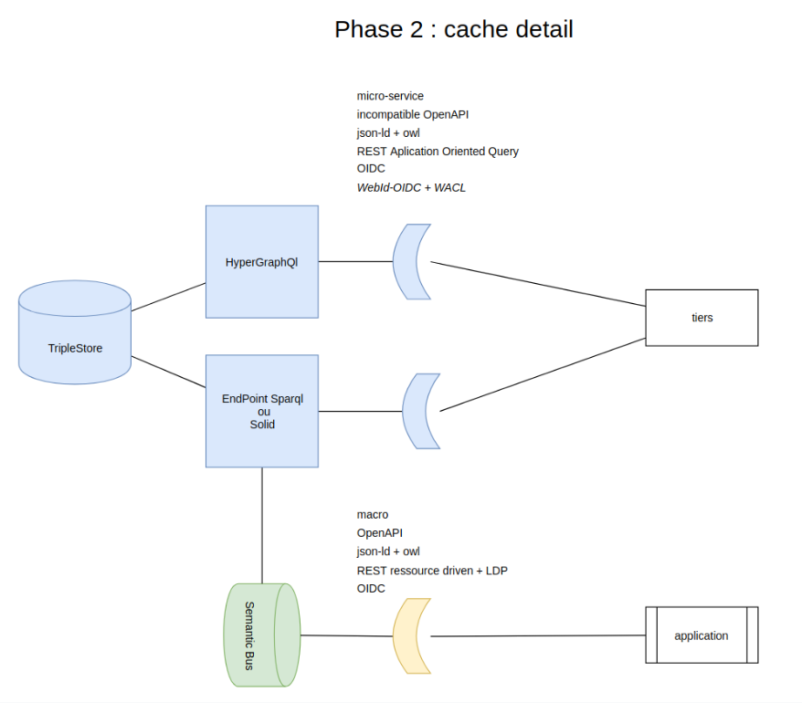

# Architecture representations

Here we try to represent some of the designs choices above between phase 1 and phase 2:

* Single or multi-source
* Identification and authentication
* Data storage

[Phase 1](https://www.draw.io/?lightbox=1&highlight=0000ff&edit=_blank&layers=1&nav=1&title=architecture%20DFC#Uhttps%3A%2F%2Fdrive.google.com%2Fuc%3Fid%3D1f1C_Inb7sOeufswQkv2nnpLgWsGbhW98%26export%3Ddownload)

[Phase 2](https://www.draw.io/?lightbox=1&highlight=0000ff&edit=_blank&layers=1&nav=1&page=1#G1f1C_Inb7sOeufswQkv2nnpLgWsGbhW98)

