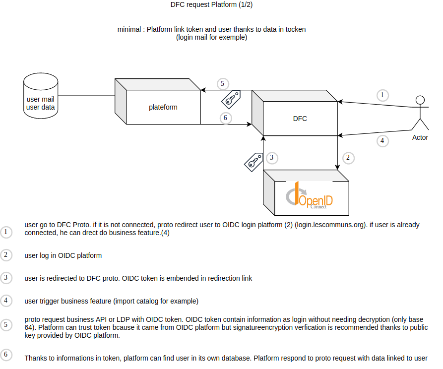
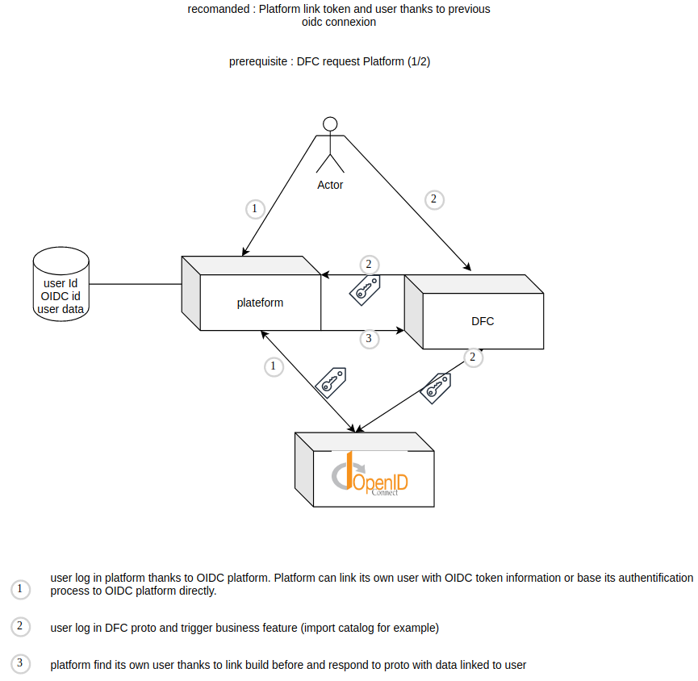

# Authentication strategy

## OpenID protocol

In order to manage authentication, we decide to support the [OpenID protocol](https://openid.net/connect/) which is a layer on top of [OAuth2 protocol](https://oauth.net/2/).

This technology is active since years and heavily supported by many big actors of the Web.

It will allow us to separate the authentication layer from the business logic one by calling a third-party application.

OIDC is federeted and centralized athentification protocol. Other decentralized protocol as WebID-OIDC exists but are not mature.

## JWT token

The OpenID authentication is based on the exchange of token based on [JSON Web Token standard](https://jwt.io/).

Basically, these token are based on encoding JSON data into base 64. The token is signed using a public key that you can find [here](https://simonlouvet.github.io/config-private/DFC-Proto/config.json).

## Explanatory scheme

