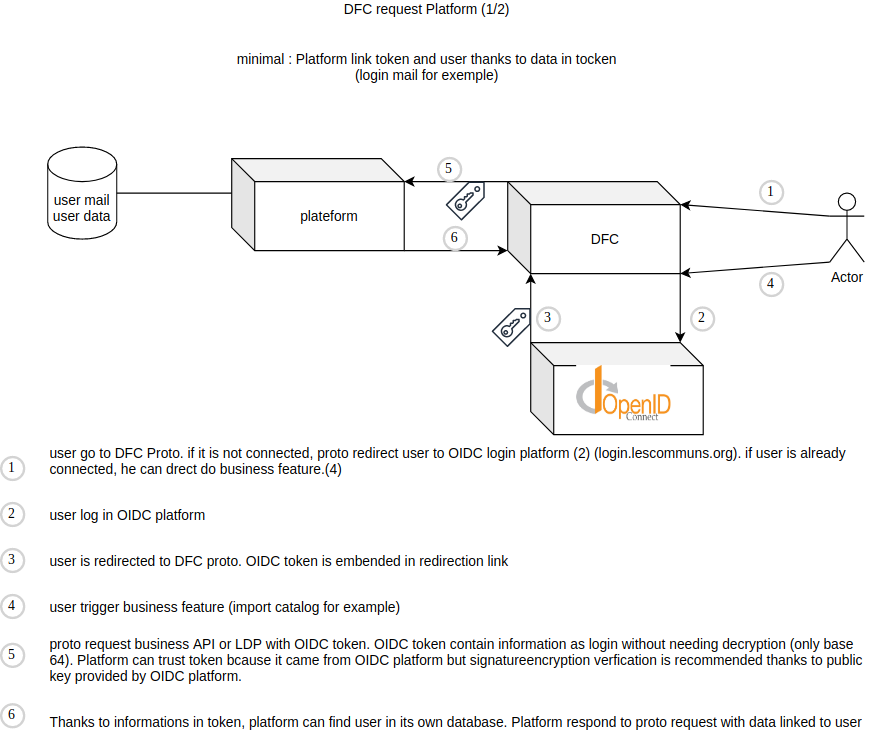
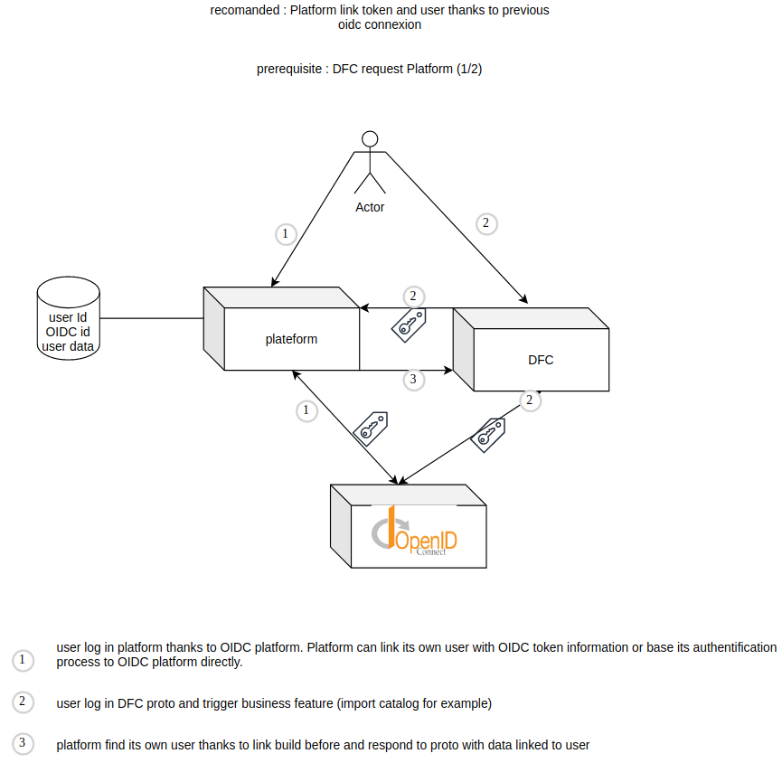

# Authentication strategy

The current consensus at DFC about authentication relies on the [OpenID Connect (OIDC)](#openid-connect-protocol-oidc) protocol.

Despites OIDC is centralized it stays relatively simple and has been proven reliable and robust since it is used by many actors of the Web for years.

The DFC OIDC implementation currently identifies the user with its email address. As we now support WebIDs it can make sense to move to Solid-OIDC to identify the user with its WebID.

Decentralized authentication mechanisms exist like the [Decentralized Identifiers W3C standard](#decentralized-identifiers) but it is more complicated to set up and quite new (2022). The DFC consensus might evolve to use this kind of authentication in the future.

## OpenID Connect (OIDC)

The [OpenID Connect (OIDC)](https://openid.net/connect/) is an authentication layer on top of the [OAuth2](https://oauth.net/2/) authorization framework. Clients implementing OIDC do delegate the authentication to a third-party application that allows the user to authenticate. Once the user is logged in a token is returned to the client so it can perform authenticated requests to access to protected resources. 

The OpenID authentication is based on the exchange of tokens following the [JSON Web Token standard](#rfc7519). Basically these tokens contains base64 encoded JSON data. A token is composed of 3 parts separated by dots: the *header*, the *payload* and the *signature*. These 3 parts are encoded using Base64url method. The algorithm used to sign DFC tokens is RS256 (RSA signature with SHA-256). DFC tokens are not encrypted. The header sent to your platform will look like `Authorization: JWT <token>` (*\<token\>* will be replaced by the actual token in clear, base64 encoded). You can use https://jwt.io/ to play with JWT tokens. Tools like Insomnia or Postman can help you during the token implementation process to send and debug HTTP requests.

It is very important to verify the signature to be sure that the token is coming from the DFC server. To verify the signature, you can use the openSSL verify function or use a JWT library that will do the work you you. The signature can be controlled thanks to a public key that you can find [here](https://simonlouvet.github.io/config-private/DFC-Proto/config.json) (inside the public_key field). Doing so, you would probably have to surround the key manually with its type headers (-----BEGIN PUBLIC KEY----- and -----END PUBLIC KEY-----). Sometimes, depending of your library, you even need to respect the .pem format by adding break line mentions in the headers (-----BEGIN PUBLIC KEY-----\n and \n-----END PUBLIC KEY-----). Nowadays, OIDC libraries can handle this token verification automatically by checking the Public key directly on the OIDC server. This method often refers as JWKS one and you have the JWKS uri for LesCommuns OIDC server here: https://login.lescommuns.org/auth/realms/data-food-consortium/protocol/openid-connect/certs. And even for more automation, the Discovery url for the Data Food Consoritum Realm is: https://login.lescommuns.org/auth/realms/data-food-consortium/.well-known/openid-configuration.

**Each platform wishing to join the DFC project MUST have a client configured on our Single-Sign-On server (SSO) provided by our partner lescommuns.org.** Please contact the DFC team to do so.

To learn more about the OpenID Connect protocol you can browse the official [OpenId Connect specification](#openid-connect). To learn more about OAuth2 you can read *The OAuth 2.0 Authorization Framework* ([RFC 6749](#rfc6749)) and *The OAuth 2.0 Authorization Framework: Bearer Token Usage* ([RFC 6750](#rfc6750)).

## Solid-OIDC

TBD

# References

## Normative references

### [OpenID Connect]

OpenID Connect Core 1.0 incorporating errata set 2. URL: https://openid.net/specs/openid-connect-core-1_0-final.html.

### [RFC6749]

The OAuth 2.0 Authorization Framework. URL: https://datatracker.ietf.org/doc/html/rfc6749.

### [RFC6750]

The OAuth 2.0 Authorization Framework: Bearer Token Usage. URL: https://datatracker.ietf.org/doc/html/rfc6750.

### [RFC7519]

JSON Web Token (JWT). Internet Engineering Task Force (IETF). URL: https://datatracker.ietf.org/doc/html/rfc7519.

## Informative references

### [Decentralized Identifiers]

Decentralized Identifiers (DIDs) v1.0 Core architecture, data model, and representations. URL: https://www.w3.org/TR/did-1.0/.

### [Solid OIDC]

(https://solidproject.org/TR/oidc)

### [Solid-OIDC Primer]

(https://solidproject.org/TR/oidc-primer)

### [did:solid Method Specification]

(https://solid.github.io/did-method-solid/)