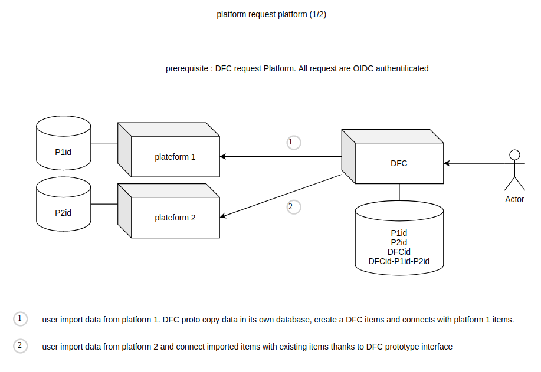
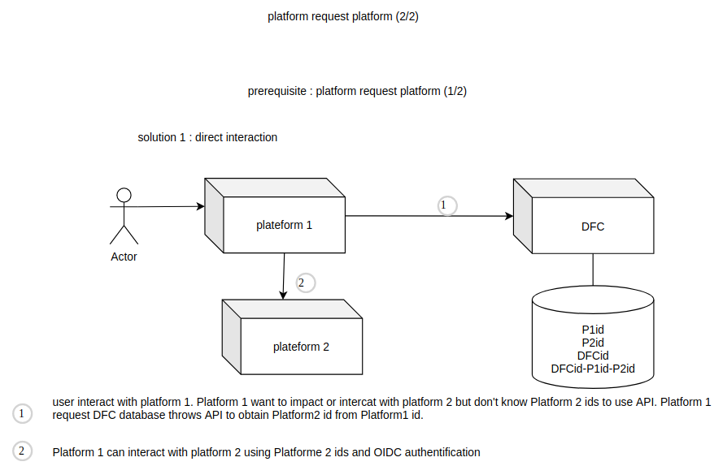
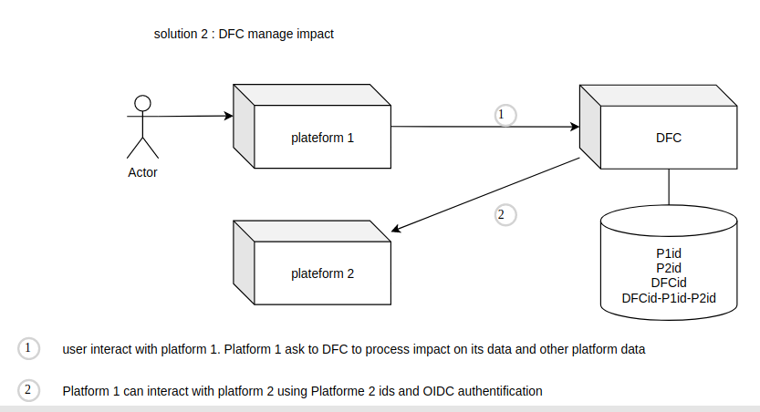

# Decentralised identifier matching référence system

DFC choose to not centralised an unique identifier référence system for catalog product nor all other subject. We could use Open Food Fact or GS1 référence system but both have come up agains political or technical problems. DFC provide an a médiation intermediary to deal identifier matcher betwen platform. Prototype provide this feature bit it is open source and free to use.

