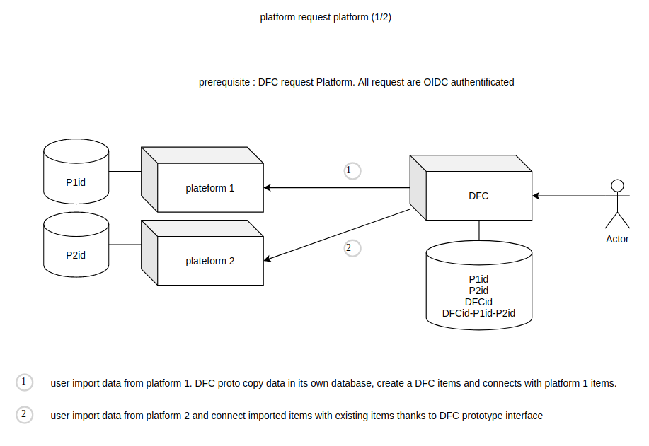
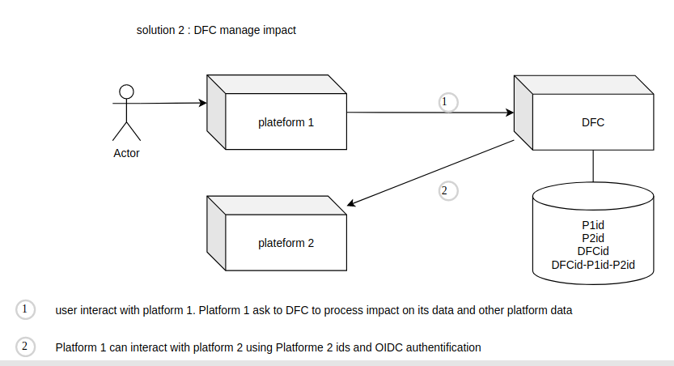

# Decentralized identifier matching reference system

The DFC prototype wants to provide a data synchronization system: we want to update a product of a platform 1 when its equivalent is changed by a platform 2. But how to know that a product stored on a platform 1 matches a product stored on a platform 2? When dealing with interoperability, we need a mechanism to match equivalent data across multiple platforms.

### We choose a mediation intermediary

DFC choose to provide a mediation intermediary to deal identifier matching between platforms. Our prototype provide this feature as open source and it is free to use. We did not want to use centralized unique identifier reference system like _Open Food Fact_ or _GS1_. Indeed, these systems come up against political or technical problems.

### A pivot is used on the technical side

The DFC prototype use a meta identifier, a _pivot_ that groups together the URIs to be matched. This meta identifier or pivot is further called the `DFCid`. We are using the `DFCid` mainly to avoid extra complexity and performance issues as we develop a prototype. Event system solutions are currently being studied as they could provide automatic data matching.

### Two ways of synchronizing different platforms data using the DFC pivot

Before data can be synchronized, it has to be imported into the DFC prototype. Moreover, the data has to be manually matched together using the prototype user interface. The following image shows the process of matching the data of two platforms into the prototype database. As you will notice, a `DFCid` is created for storing the matching of the equivalent items managed by two different platforms.

#### A platform can directly request a change on a second one

After data is matched inside the DFC prototype, a platform 1 can request to change an item managed by a platform 2 after getting its identifier (URI) using the DFC prototype API. For example, the platform 1 can request to update the name of the equivalent item stored on the platform 2.

#### A platform can ask the DFC prototype to request a change on a second one (delegation)

If the platform 1 does not want to request a change on the platform 2 by itself, it can request the DFC prototype to request that change for it.

